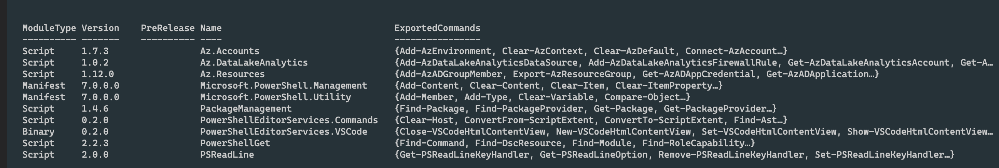

# Setting up a self hosted build agent

> [help](https://docs.microsoft.com/en-gb/azure/devops/pipelines/agents/agents?view=azure-devops&tabs=browser)

> [images](https://github.com/actions/virtual-environments)

### Install dotnet
> https://docs.microsoft.com/en-us/dotnet/core/tools/dotnet-install-script
> https://www.opentechguides.com/how-to/article/powershell/105/powershel-security-error.html

- Install-Module AzureAD
- Get-InstalledModule Az.Accounts -AllVersions
- Get-InstalledModule -Name Az -AllVersions | select Name,Version
- Install-Module -Name AzureAD -RequiredVersion 2.0.2.31 
- Get-Module
- Get-PSRepository 
- Install-module AzureADPreview

1. Install new repository: 
```
Register-PackageSource -Trusted -ProviderName 'PowerShellGet' -Name 'Posh Test Gallery' -Location https://www.poshtestgallery.com/api/v2/
```

2. List/check repositories
```
Get-PSRepository  
```

3. Install module
```
Install-Module -Name AzureAD.Standard.Preview
```

4. Check module installed
```
Get-Module 
```



### How to install a powershell library

```
Install-Module -Name Az.Compute -AllowPrerelease -Repository 'PSGallery'
```
